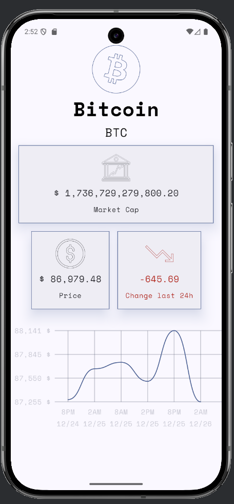
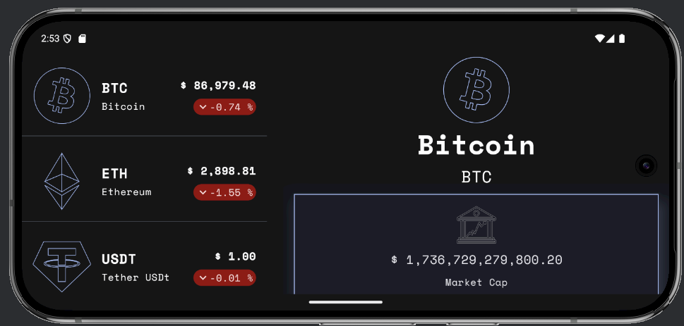
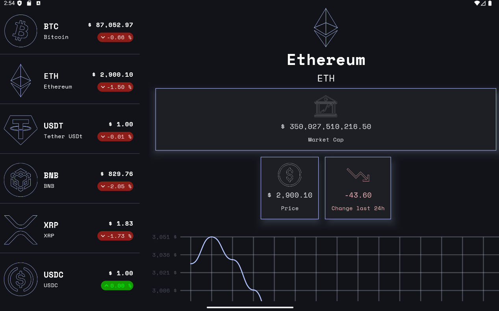
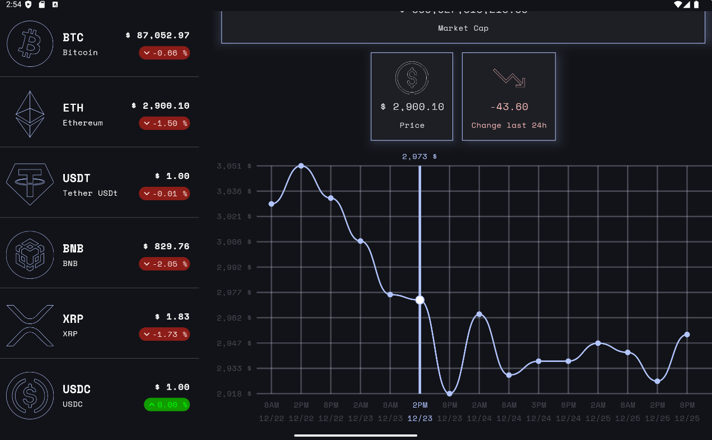

# CryptoTracker 🚀 

A modern Cryptocurrency tracker built with **Kotlin** and **Jetpack Compose**. This application provides real-time market insights and professional financial visualizations to help users track their favorite digital assets.

---

## 🛠 Tech Stack & Architecture

This project follows **Modern Android Development (MAD)** practices:

* **UI:** [Jetpack Compose](https://developer.android.com/jetpack/compose) (100% Declarative UI).
* **Networking:** [Ktor](https://ktor.io/) (Asynchronous networking client).
* **Dependency Injection:** [Koin](https://insert-koin.io/) (Lightweight DI).
* **Concurrency:** [Kotlin Coroutines](https://kotlinlang.org/docs/coroutines-overview.html) & [Flow](https://kotlinlang.org/docs/flow.html).
* **Architecture:** Clean Architecture with **MVVM** pattern.
* **Data Visualization:** Interactive **Candlestick Charts** (OHLC Data).

---

## ✨ Key Features

* **Real-time Market Data:** Seamlessly fetches live crypto prices and statistics using Ktor.
* **Interactive Candlestick Charts:** Advanced visualization of price action (Open, High, Low, Close) for market analysis.
* **State Management:** Robust UI state handling using `StateFlow` and lifecycle-aware collectors.
* **Dependency Injection:** Modular and scalable code structure powered by Koin.
* **Responsive Design:** Fully optimized for different screen sizes with a modern Material 3 look.

---

## 📸 Screenshots

| Market Overview | Price Analysis | Adaptive Screen | Adaptive Screen | Adaptive Screen TB |
| :---: | :---: | :---: | :---: |
|  |  |  |  |  |

---

## ⚙️ Setup & Installation

1.  **Clone the repository:**
    ```bash
    git clone [https://github.com/abanoobsamy/Crypto-Tracker.git](https://github.com/abanoobsamy/Crypto-Tracker.git)
    ```
2.  **Open in Android Studio:**
    Wait for Gradle sync to complete.
3.  **Run the app:**
    Select your emulator or physical device and click **Run**.

---

## 🛡 License

This project is licensed under the **MIT License** - see the [LICENSE](LICENSE) file for details.